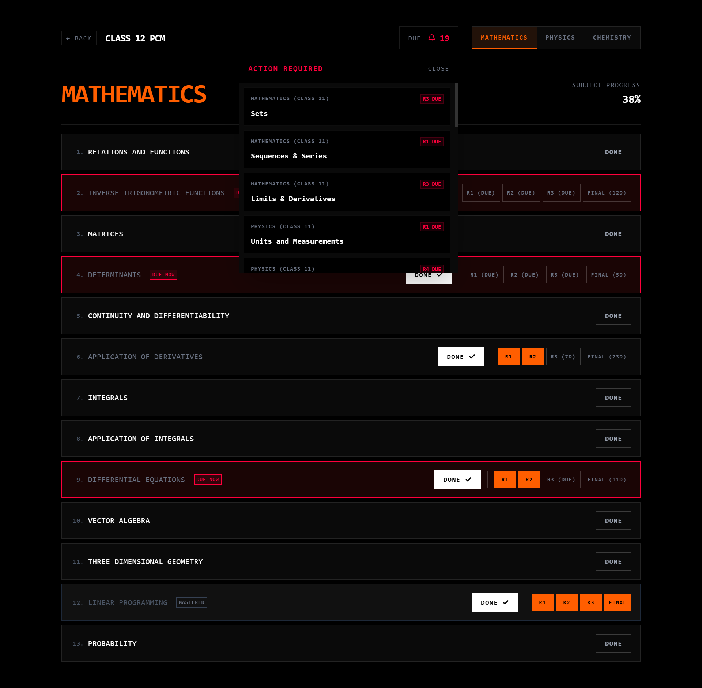

# PCM Syllabus Tracker | JEE Mains & Advanced



A high-performance, brutalist-inspired syllabus tracker for Class 11 and 12 Physics, Chemistry, and Mathematics (PCM). Built for students preparing for JEE Mains, JEE Advanced, and CBSE board exams to master their syllabus using **spaced repetition**.

**Live Deployment:** [https://pcm-syllabus-tracker-eight.vercel.app](https://pcm-syllabus-tracker-eight.vercel.app)

## Features
- **Spaced Repetition:** Enforces scheduled revisions (3d, 7d, 14d, 30d) based on memory curves.
- **Brutalist UI:** Zero distractions, 1px borders, high-contrast, lightning fast.
- **Anti-Reset Security:** Requires manual code entry to unmark completed tasks, preventing accidental data loss.
- **Due Panel:** Instant global view of exactly what topics are due for revision today.
- **Local Storage:** 100% private. Your data never leaves your browser.

## Getting Started

First, run the development server:

```bash
pnpm dev
```

Open [http://localhost:3000](http://localhost:3000) with your browser to see the result.
